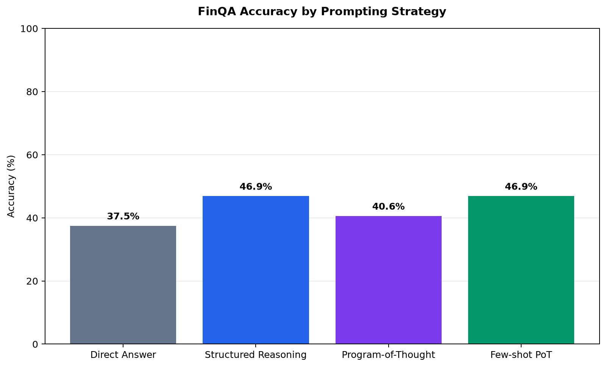
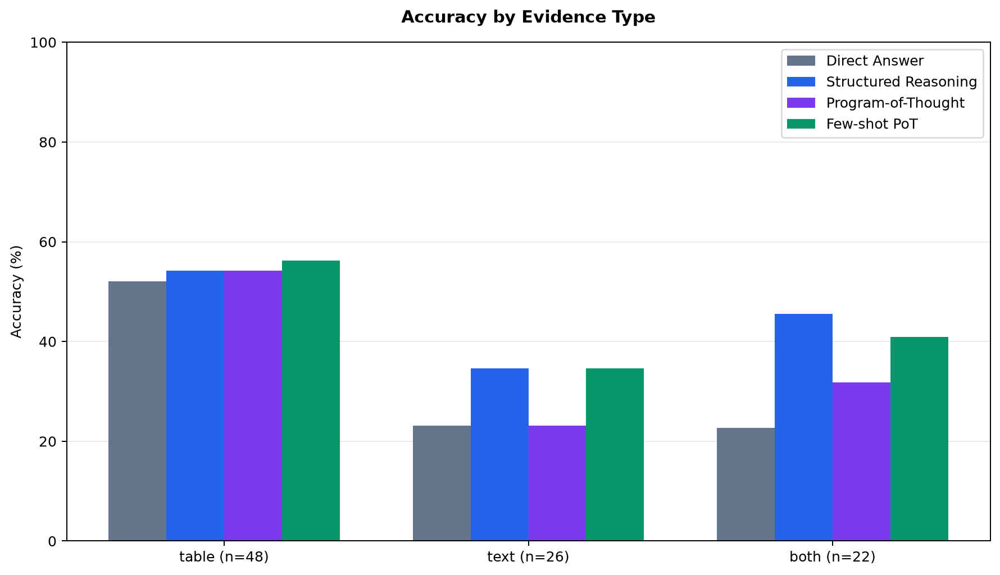
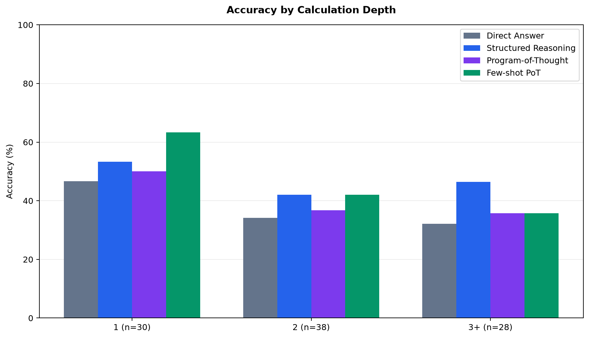

# FinQA LLM Evaluation Lab

[](https://github.com/SS-Awan/finqa-llm-evaluation-lab/actions/workflows/ci.yml)

A reproducible evaluation project that compares LLM prompting strategies for financial question answering.

**Live dashboard:** [View the deployed evaluation dashboard](https://ss-awan.github.io/finqa-llm-evaluation-lab/)

## Why I built this

Financial QA requires more than arithmetic. A model has to locate relevant information in financial-report text and tables, choose a calculation, and return a correct numerical answer.

I built this project to test whether structured prompting and constrained Program-of-Thought outputs improve performance compared with a simple direct-answer prompt.

## Current capabilities

- Loads and validates FinQA records from local source data
- Creates a locked 96-record numeric test manifest for reproducible evaluation
- Evaluates four prompt strategies on the same records
- Uses Pydantic schemas to validate structured model outputs
- Executes Program-of-Thought plans through a restricted local calculation DSL
- Saves each evaluation result to JSONL for checkpointing and resume support
- Scores numeric answers and generates grouped analysis reports
- Creates PNG charts for repository documentation
- Includes a deployed static dashboard built from saved results
- Includes 44 automated tests and GitHub Actions CI

## Live dashboard

The public dashboard presents the saved evaluation results, strategy comparison, reliability checks, question-type charts, and plan-consistency analysis.

[Open the FinQA LLM Evaluation Dashboard](https://ss-awan.github.io/finqa-llm-evaluation-lab/)

The dashboard uses committed static files only. It makes no live Gemini requests and does not expose an API key.

## Prompt strategies

1. **Direct Answer** — requests only the final numerical answer.
2. **Structured Reasoning** — requests evidence, a reasoning summary, and a final answer.
3. **Program-of-Thought** — requests evidence and a restricted executable calculation plan.
4. **Few-shot Program-of-Thought** — provides fixed development examples before requesting a calculation plan.

## Results

The evaluation used `gemini-3.5-flash-lite` on the same locked set of 96 FinQA test records.

| Strategy | Correct | Accuracy |
|---|---:|---:|
| Direct Answer | 36 / 96 | 37.5% |
| Structured Reasoning | 45 / 96 | 46.9% |
| Program-of-Thought | 39 / 96 | 40.6% |
| Few-shot Program-of-Thought | 45 / 96 | 46.9% |



Key findings:

- Structured Reasoning and Few-shot Program-of-Thought tied for the best overall accuracy.
- Structured Reasoning performed best on questions requiring both text and table evidence.
- Few-shot Program-of-Thought performed best on one-step calculations.
- Table-only questions were easier than text-only questions.
- All 384 model outputs were valid, and all 192 generated calculation plans were executable.





## Reliability checks

| Check | Result |
|---|---:|
| Total evaluations | 384 |
| Results per strategy | 96 |
| Valid structured outputs | 384 / 384 |
| Generation or execution errors | 0 |
| Executable calculation plans | 192 / 192 |

## Failure analysis

The project separately analyses strategy disagreements and plan consistency.

| Finding | Result |
|---|---:|
| Records solved by all strategies | 30 |
| Records solved by no strategy | 44 |
| Direct Answer wrong, Structured Reasoning correct | 10 |
| Direct Answer wrong, Few-shot PoT correct | 13 |

A key result is that a plan can be structurally valid and executable without being financially correct:

| Strategy | Executable plans | Plan matched gold answer | Final answer matched gold | Plan/final disagreement |
|---|---:|---:|---:|---:|
| Program-of-Thought | 96 | 24 | 39 | 65 |
| Few-shot Program-of-Thought | 96 | 24 | 45 | 57 |

This distinction is why the evaluator reports plan validity, executed-plan output, and final-answer accuracy separately.

## Tech stack

- Python
- Google Gen AI SDK
- Gemini 3.5 Flash Lite
- Pydantic
- Pytest
- Matplotlib
- JSONL result storage
- GitHub Actions
- GitHub Pages

## Project structure

```text
.github/
  workflows/
    ci.yml                    # Automated test workflow

src/finqa_eval/
  analysis.py                 # Metrics and grouped analysis
  batch.py                    # Checkpointed, rate-limited batch execution
  config.py                   # Local Gemini configuration
  dataset.py                  # FinQA loading and validation
  few_shot.py                 # Fixed development examples
  gemini_client.py            # Structured Gemini client
  plans.py                    # Restricted calculation-plan DSL
  prompts.py                  # Prompt construction
  results.py                  # JSONL result storage
  runner.py                   # One-record evaluation logic
  sampling.py                 # Locked sample manifest
  schemas.py                  # Response schemas
  scoring.py                  # Numeric answer scoring

scripts/
  run_pilot.py
  run_final_evaluation.py
  analyze_results.py
  analyze_failures.py
  build_dashboard_data.py
  generate_charts.py

data/
  evaluation/                 # Locked evaluation manifest
  results/                    # Saved result files

docs/
  assets/                     # Generated charts
  dashboard-data.json         # Static dashboard data
  index.html                  # GitHub Pages dashboard

tests/
```

## Data source

This project uses the [FinQA benchmark](https://arxiv.org/abs/2109.00122), a financial question-answering dataset based on company reports.

The raw dataset is intentionally excluded from Git. Data provenance is documented in [docs/data_source.md](docs/data_source.md).

## Local setup

1. Clone the repository.

```cmd
git clone https://github.com/SS-Awan/finqa-llm-evaluation-lab.git
cd finqa-llm-evaluation-lab
```

2. Create and activate a virtual environment.

```cmd
python -m venv .venv
.venv\Scripts\activate
```

3. Install dependencies.

```cmd
python -m pip install -e ".[dev]"
```

4. Clone the FinQA source data locally.

```cmd
git clone https://github.com/czyssrs/FinQA.git data/raw/finqa-source
git -C data/raw/finqa-source checkout 0f16e2867befa6840783e58be38c9efb9229d742
```

5. Create a `.env` file from `.env.example`.

```text
GEMINI_API_KEY=your_api_key_here
GEMINI_MODEL=gemini-3.5-flash-lite
```

Never commit `.env`.

## Example commands

Run tests:

```cmd
pytest
```

Run the saved-result analysis:

```cmd
python scripts\analyze_results.py
```

Run the plan-consistency and failure analysis:

```cmd
python scripts\analyze_failures.py
```

Generate charts:

```cmd
python scripts\generate_charts.py
```

Build static dashboard data:

```cmd
python scripts\build_dashboard_data.py
```

Check the full evaluation configuration without sending API requests:

```cmd
python scripts\run_final_evaluation.py --dry-run
```

Run the full evaluation:

```cmd
python scripts\run_final_evaluation.py
```

The batch runner saves each completed result immediately. If interrupted, rerunning the same command resumes from saved record-strategy pairs.

## Limitations

- Results are from one model and one locked 96-record sample.
- The analysis is descriptive and does not claim statistical significance.
- Some operation categories have small sample sizes and are not overinterpreted.
- FinQA source data and Gemini API access are external dependencies.

## Next steps

- Add formal paired statistical comparisons between prompting strategies
- Run the same locked manifest on additional models
- Expand the evaluation set while preserving the existing frozen benchmark
- Add error-category labels for qualitative review

## Author

Sohaib Shahid Awan